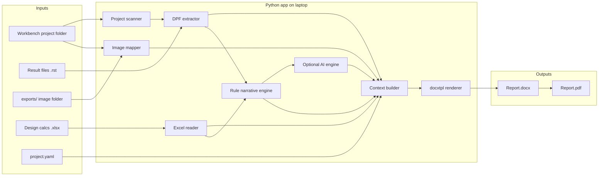

# ANSYS Report Automation — Detailed Implementation Document

> **Status (2026-06):** MVP implemented — package skeleton, config, DPF extractors (with graceful fallback), Excel reader, image mapper, rule-based (+ optional AI) narratives, section plugins, docxtpl render, PDF export, CLI (`build`/`validate`/`template`), tests, and user docs. Harmonic Y/Z, transient, and CFD remain Phase 6. DPF integration tests require `ANSYS_AVAILABLE=1`.

> Laptop-local Python application that ingests ANSYS results, merges Excel design
> calculations, fills an EP1763-style Word template, and exports DOCX/PDF — with
> rule-based engineering text by default and optional AI narratives when an API
> key is configured.

- **Requirements source:** `doc_con.txt`
- **Output contract (reference report):** `EP1763_May1_R0.docx`
- **Deployment target:** Individual engineering laptops (Windows + licensed ANSYS). No server, no cloud services in v1.
- **Primary language/runtime:** Python 3.10+

---

## 1. Goals and Non-Goals

### 1.1 Goals

1. Reduce report assembly time from 3–6 hours to under 15 minutes for enabled sections.
2. Produce a review-ready `.docx` that matches the EP1763 structure: cover metadata, numbered sections, captioned figures, results tables, per–load-case conclusions, and design-calculation tables.
3. Auto-export to PDF locally (no cloud).
4. Hybrid ANSYS extraction: numbers from `.rst` via DPF; images from a Mechanical export script **or** a folder the engineer populates.
5. Dual narrative engine: deterministic rule-based text by default, optional AI polish when an API key is present.
6. Run entirely offline (except optional AI calls), installable with `pip install -e .`.

### 1.2 Non-Goals (v1)

- No FastAPI/REST service, no Redis/Celery job queue, no PostgreSQL, no S3/Azure Blob.
- No RAG/vector database for narratives.
- No full automated parity with all 158 figures / 57 tables of EP1763 on day one. Sections are enabled incrementally.
- No CFD (Fluent/CFX) automated extraction in v1 (Phase 6).
- No multi-project comparison or optimization reports (doc_con Phase 2/3 items).

---

## 2. Output Contract Derived from EP1763

The reference document contains ~3,800 text blocks, **158 images**, **57 tables**, and uses Word styles `Heading1`–`Heading4` and `Caption` (plus `TOC1`–`TOC4`, `TableofFigures`). The template MUST preserve these styles so the Table of Contents and List of Figures regenerate correctly.

### 2.1 Document blocks and automation strategy

| Block | EP1763 pattern | Automation strategy |
|-------|----------------|---------------------|
| Cover | BOM ID, equipment title, customer, Prepared/Checked/Approved roles | `project.yaml` metadata |
| Front matter | §1 Revision Log, §2 Scope + analysis-type matrix, §3 Software/Tools, §4 References | Static tables + config-driven rows |
| §5 Equipment | CAD figures, mass/material/COG tables, component list | Images (folder/export) + DPF/config mass+COG |
| §6 Modelling | Geometry, FE mesh, mesh quality plots (element quality, aspect ratio, Jacobian, skewness, max corner angle), joint/contact/material modelling | DPF mesh statistics + image map |
| §7.1 Modal | BCs, mode shapes 1–6 with frequencies, conclusions | DPF modal extractor + section plugin |
| §7.2 Static Structural | BCs, loading, deformation, von-Mises stress per material, reaction force/moment, conclusions | DPF static extractor + section plugin |
| §7.3 Harmonic (X/Y/Z) | BCs, displacement amplitude, stress per material per direction, conclusions | Section plugin (Phase 6 for Y/Z) |
| §7.4 Transient Shock (X/Y/Z) | BCs, shock pulse spec, transient results, conclusions | Section plugin (Phase 6) |
| §8 CFD | Mesh, Y+, velocity/pressure distribution, valve coefficient | Phase 6 (out of v1 core) |
| §9 Material Properties | Material tables | Config/Excel |
| §10 Design Calculations | Bolt load, flange moments, effort, end-flange selection; tabular with FOS / ACCEPTABLE verdicts | `openpyxl` + table render |

### 2.2 v1 enabled sections (configurable)

Default `sections_enabled` for the MVP targets the most-used subset:

```
revision, scope, software, references, equipment, modelling,
modal, static, harmonic_x, design_calcs
```

Full parity (harmonic Y/Z, transient X/Y/Z, full CFD) is delivered in Phase 6 using the same section-plugin interface, so adding a section never requires touching the renderer.

---

## 3. System Architecture



### 3.1 Data flow (end-to-end)

1. **Scan** project directory → locate `.wbpj`, result `.rst` files, export folders.
2. **Extract** numeric results via DPF; resolve image paths via image mapper.
3. **Read** Excel design calculations into normalized parameter records.
4. **Narrate** — rules engine produces draft observations/conclusions; optional AI polishes them.
5. **Build context** — a single validated dictionary (Pydantic models) consumed by the template.
6. **Render** — `docxtpl` fills the EP1763 template → `.docx`.
7. **Convert** — `.docx` → `.pdf` locally.

---

## 4. Repository Layout

```
ansys-automation/
  pyproject.toml                  # Python 3.10+, pinned deps, console_scripts
  README.md                       # install, ANSYS version, one example run
  .env.example                    # ANTHROPIC_API_KEY / OPENAI_API_KEY (gitignored real)
  .gitignore
  config/
    project.example.yaml          # EP1763-style metadata + section toggles
    image_map.example.yaml        # filename -> figure slot
    thresholds.yaml               # yield %, FOS, freq bands for rule text
  templates/
    EP1763_report_template.docx   # derived from sample; Jinja2 placeholders
  src/
    ansys_report/
      __init__.py
      cli.py                      # entry: ansys-report build/validate/template
      config.py                   # Pydantic models + YAML loader
      scanner.py                  # find .wbpj, .rst, export dirs
      models.py                   # dataclasses/Pydantic for extracted results
      extract/
        __init__.py
        dpf_base.py               # shared DPF session + helpers
        dpf_static.py             # stress, deformation, reactions
        dpf_modal.py              # frequencies, participation factors
        dpf_mesh.py               # node/element counts, quality metrics
        mechanical_export.py      # optional: run image-export script
      images/
        __init__.py
        mapper.py                 # resolve paths, validate resolution/DPI
      excel/
        __init__.py
        reader.py                 # openpyxl named ranges/tables
      narrative/
        __init__.py
        rules.py                  # threshold-based text
        ai.py                     # optional Claude/OpenAI
        prompts.py                # prompt templates
      report/
        __init__.py
        context_builder.py        # assemble validated render context
        render.py                 # docxtpl
        pdf.py                    # docx2pdf / LibreOffice fallback
      sections/                   # one module per EP1763 section
        __init__.py
        base.py                   # ReportSection protocol/ABC
        equipment.py
        modelling.py
        modal.py
        static_structural.py
        harmonic.py
        design_calcs.py
  scripts/
    create_template_from_sample.py  # one-time: inject {{PLACEHOLDERS}}
    mechanical_export_views.py      # runs inside Mechanical (IronPython/CPython)
  tests/
    fixtures/
      mock_results.json
      sample_calcs.xlsx
      img/                          # 1-2 tiny PNGs
    test_config.py
    test_excel_reader.py
    test_rules.py
    test_context_builder.py
    test_render_smoke.py
  output/                           # generated reports (gitignored)
```

---

## 5. Configuration Model

### 5.1 `project.yaml`

```yaml
bom_id: "EP 1763"
title: "FLANGED STRAIGHT WAY STOP VALVE WITH MANUAL CONTROL, Ti ALLOY NB40 NP40"
customer: "M/S ULTRA DIMENSIONS PVT. LTD., VISAKHAPATNAM"
prepared_by: { name: "Guravaiah V", role: "CAE Engr" }
checked_by:  { name: "Aniket N", role: "CAE Engr" }
approved_by: { name: "Ashok Varma R", role: "Sr. General Manager" }
ansys_version: "2024 R2"

project_dir: "D:/Projects/EP1763"
image_folder: "exports"             # relative to project_dir
excel_calcs: "design_calcs.xlsx"    # relative to project_dir

sections_enabled:
  - revision
  - scope
  - software
  - references
  - equipment
  - modelling
  - modal
  - static
  - harmonic_x
  - design_calcs

# Engineering inputs used by rule-based narratives
operating_freq_hz: [10, 200]        # operating band for resonance check
materials:
  - name: "MAT_ASTM B 367 Gr.5"
    yield_mpa: 350
    uts_mpa: 480
modal:
  num_modes: 6
static:
  fos_target: 1.5
```

### 5.2 `image_map.yaml`

Maps export filenames to template figure slots. Missing entries are flagged by the validator.

```yaml
# template_slot: filename (relative to image_folder)
cad_isometric:            "geometry/cad_iso.png"
cad_section:              "geometry/cad_section.png"
mesh_global:              "mesh/mesh_global.png"
mesh_quality_aspect:      "mesh/aspect_ratio.png"
modal_mode1:              "modal/mode1.png"
modal_mode2:              "modal/mode2.png"
modal_mode3:              "modal/mode3.png"
modal_mode4:              "modal/mode4.png"
modal_mode5:              "modal/mode5.png"
modal_mode6:              "modal/mode6.png"
static_total_deformation: "static/total_deformation.png"
static_vonmises_stress:   "static/vonmises.png"
static_reaction_force:    "static/reaction_force.png"
harmonic_x_bc:            "harmonic_x/bc.png"
harmonic_x_amplitude:     "harmonic_x/amplitude.png"
harmonic_x_stress:        "harmonic_x/stress.png"
```

### 5.3 `thresholds.yaml`

```yaml
stress:
  warn_fraction_of_yield: 0.80      # > 80% yield -> caution wording
  fail_fraction_of_yield: 1.00
fos:
  min_acceptable: 1.5
modal:
  resonance_margin_hz: 10           # flag modes within band +/- margin
deformation:
  warn_mm: 1.0                      # project-overridable
```

### 5.4 Pydantic validation rules

- `project_dir`, `image_folder`, `excel_calcs` paths resolved and existence-checked at load.
- `sections_enabled` validated against the registered section plugin keys.
- Each material requires `yield_mpa`; AI is disabled with a clear log line if no API key.
- `operating_freq_hz` must be a 2-element ascending list.

---

## 6. Module Specifications

### 6.1 Project Scanner (`scanner.py`)

**Responsibility:** Discover inputs under `project_dir`.

- Locate `.wbpj` and Workbench `dp0/SYS*/MECH/file.rst` result trees.
- Identify export folders (configured `image_folder` plus common defaults like `report_assets/`).
- Return a `ProjectInventory` model: `rst_files: dict[str, Path]` keyed by system name, `image_root: Path`, `excel_path: Path`.
- Fail fast with actionable messages (e.g., "No .rst found under dp0; run the solve or point project_dir at the right folder").

### 6.2 DPF Extraction (`extract/`)

Uses [`ansys-dpf-core`](https://dpf.docs.pyansys.com/) to read `.rst` offline.

- `dpf_base.py`: open a DPF `Model`, expose mesh + result helpers, unit handling (MPa, mm, Hz, N).
- `dpf_static.py`:
  - Max equivalent (von-Mises) stress (overall + per named selection/material where available).
  - Max total deformation.
  - Reaction force and moment at fixed supports.
  - Derived FOS = `yield_mpa / max_stress_mpa`.
- `dpf_modal.py`:
  - Natural frequencies for modes 1..`num_modes`.
  - Participation factors where available.
- `dpf_mesh.py`:
  - Node count, element count, basic quality metric summaries (min/max/avg) for mesh statistics table.
- All extractors return typed models from `models.py`; raw arrays are not passed downstream.

**Fallback:** If DPF cannot resolve a value, the field is set to `None` and the validator lists it as "manual entry required" rather than crashing.

### 6.3 Mechanical Export (optional, `extract/mechanical_export.py` + `scripts/mechanical_export_views.py`)

- When Mechanical is open, connect via [`ansys-mechanical-core`](https://mechanical.docs.pyansys.com/) and run an export script that calls `ExtAPI.Graphics.ExportImage` for named views at configured resolution (1920×1080 / 3840×2160) and DPI ≥ 300.
- Output PNGs land in `image_folder` using the names expected by `image_map.yaml`.
- This path is **optional**: if Mechanical is not running, the engineer populates `image_folder` manually (Path B).

### 6.4 Image Mapper (`images/mapper.py`)

- Resolve each template slot to an absolute path via `image_map.yaml`.
- Validate existence; warn if resolution/DPI below threshold (best-effort via PIL).
- Produce a `MissingAssets` report so the user gets a single checklist instead of silent blanks.
- Provide `InlineImage` objects to the renderer at the correct width (e.g., `Mm(150)`).

### 6.5 Excel Reader (`excel/reader.py`)

- Read with `openpyxl(load_workbook(..., data_only=True))` to get computed values.
- Support both named ranges and explicit sheet/cell tables.
- Normalize to `list[CalcRow]` = `{label, symbol, formula, value, unit, source_ref, verdict}` mirroring EP1763 Section 10 (e.g., "FOS", "Ab/Am", 16.36, "", "ASME...", "ACCEPTABLE").
- Expose grouped tables (Bolt Load, Flange Moments, Effort, End Flange) for separate template tables.

### 6.6 Narrative Engine (`narrative/`)

**Default — `rules.py`:** deterministic text from thresholds.

- Static: compares `max_stress` to `warn/fail_fraction_of_yield`; emits observation + conclusion sentences and a PASS/CAUTION/FAIL verdict.
- Modal: checks each frequency against `operating_freq_hz` ± `resonance_margin_hz`; emits resonance-risk wording.
- Executive summary: composes a stub from per-section verdicts.

**Optional — `ai.py` + `prompts.py`:**

- Enabled only if `ANTHROPIC_API_KEY` or `OPENAI_API_KEY` is set.
- Input: structured JSON of extracted scalars + the rule-based draft.
- Never sends geometry/model files — scalars and the draft only.
- Output replaces/augments the rule text; on any API error, silently falls back to rule text and logs a warning.

### 6.7 Section Plugins (`sections/`)

A uniform interface so adding a section never touches the renderer.

```python
# sections/base.py
class ReportSection(Protocol):
    key: str                      # matches sections_enabled entry
    def is_enabled(self, cfg) -> bool: ...
    def extract(self, inventory, cfg) -> dict: ...   # numbers + image slots
    def narrate(self, data, cfg) -> dict: ...        # observations/conclusions
    def context(self, data, narrative) -> dict: ...  # template fragment
```

- `context_builder.py` iterates enabled plugins, merges their `context()` output into one dict.
- New sections (harmonic_y, transient_x, cfd) implement this protocol and register a key.

### 6.8 Report Renderer (`report/render.py`)

- `docxtpl.DocxTemplate(template).render(context)`.
- Inline images via `InlineImage`; loops for modal modes, materials, and calc tables via Jinja2 (``) inside the Word template.
- Preserve heading styles → TOC + List of Figures stay valid (regenerate fields on open or via a post-process step).

### 6.9 PDF Export (`report/pdf.py`)

- Primary: `docx2pdf` (uses installed Word on Windows).
- Fallback (documented): LibreOffice `--headless --convert-to pdf --outdir output report.docx`.
- Detect availability; emit a clear message if neither is present (DOCX still produced).

### 6.10 CLI (`cli.py`)

```bash
# Generate a report
ansys-report build --project-dir "D:\Projects\EP1763" --config config\project.yaml --out output\

# Validate inputs without rendering (lists missing images/values)
ansys-report validate --config config\project.yaml

# Regenerate the template skeleton from a sample docx
ansys-report template --from "EP1763_May1_R0.docx" --out templates\EP1763_report_template.docx
```

- Built with `argparse` or `typer`; exit codes: 0 success, 2 validation failure, 1 unexpected error.
- `--no-pdf`, `--no-ai`, `--verbose` flags.

### 6.11 Optional GUI (v1.1)

- Single-window **Streamlit** (localhost) or **Tkinter**: pick folder, edit key YAML fields, click Generate, show validation checklist + open output.
- No network service; wraps the same `build`/`validate` functions.

---

## 7. Template Construction Workflow

1. Copy `EP1763_May1_R0.docx` → `templates/EP1763_report_template.docx`.
2. Run `scripts/create_template_from_sample.py` to replace instance-specific text with placeholders and inject Jinja2 tags while preserving styles:
   - Scalars: `{{ bom_id }}`, `{{ static.max_stress_mpa }}`, `{{ modal.modes[0].freq_hz }}`.
   - Inline images: `` (paragraph-level).
   - Loops: `` ... `` for mode-shape figures/tables.
   - Tables: `` row loops.
3. Start minimal: cover + §7.1 modal + §7.2 static + §10 design calcs only. Add placeholders per phase.
4. Keep the original as a read-only reference for styling parity.

---

## 8. Data Models (`models.py`) — illustrative

```python
class ModeResult(BaseModel):
    index: int
    freq_hz: float
    participation: float | None = None

class StaticResult(BaseModel):
    max_stress_mpa: float | None
    max_deformation_mm: float | None
    reaction_force_n: float | None
    reaction_moment_nmm: float | None
    per_material: dict[str, float] = {}   # material -> max stress

class CalcRow(BaseModel):
    label: str
    symbol: str | None
    formula: str | None
    value: float | str
    unit: str | None
    source_ref: str | None
    verdict: str | None                   # ACCEPTABLE / NOT ACCEPTABLE

class Narrative(BaseModel):
    executive_summary: str
    observations: list[str]
    conclusions: list[str]
    recommendations: list[str]
    source: str                           # "rules" | "ai"
```

---

## 9. Testing Strategy

| Layer | Test | Tooling |
|-------|------|---------|
| Config | YAML loads, path checks, enum validation | `pytest`, Pydantic |
| Excel | known fixture -> expected CalcRows | `pytest` + `sample_calcs.xlsx` |
| Rules | thresholds produce expected verdict/wording | `pytest` (parametrized) |
| Image mapper | missing files reported, present files resolved | `pytest` + tiny PNGs |
| Context builder | enabled sections merge into one dict | `pytest` |
| Render smoke | mock context -> valid .docx opens with python-docx | `pytest` |
| DPF (optional) | gated test; skipped if no ANSYS/.rst | `pytest.mark.skipif` |

- CI is **local-only** in v1 (a `make test` / `nox` session). DPF tests skipped unless `ANSYS_AVAILABLE=1`.
- Golden-file check: render mock context and diff structural text (not byte-for-byte) against an expected outline.

---

## 10. Dependencies (pinned in `pyproject.toml`)

| Layer | Package | Notes |
|-------|---------|-------|
| ANSYS numbers | `ansys-dpf-core` | reads `.rst` offline |
| ANSYS images (opt) | `ansys-mechanical-core` | requires Mechanical running |
| Data | `pandas`, `openpyxl`, `pydantic` | |
| Config | `pyyaml` | |
| Report | `docxtpl`, `python-docx` | Jinja2 in Word |
| Images | `pillow` | resolution/DPI checks |
| PDF | `docx2pdf` | Windows + Word |
| Viz (opt) | `pyvista` | regenerate contours if exports poor |
| AI (opt) | `anthropic`, `openai` | gated on API key |
| CLI | `typer` (or `argparse`) | |
| Test | `pytest` | |

Pin to versions known-good with **ANSYS 2024 R2** (the version in EP1763's Software/Tools table).

---

## 11. Risks and Mitigations

| Risk | Impact | Mitigation |
|------|--------|------------|
| PyAnsys/DPF version mismatch with installed ANSYS | Extraction fails | Pin deps; document 2024 R2; gate DPF behind try/except with manual-entry fallback |
| 18 MB EP1763 template heavy/complex | Slow render, fragile edits | Build minimal template, grow per phase; split rare sections into includes |
| Mechanical not running | No auto images | Hybrid folder path (Path B) always works |
| No network / no API key | No AI text | Rule-based default is always available |
| TOC / List of Figures not auto-updating | Manual fix | Document "update fields" on open; optional Word COM post-process on Windows |
| Inconsistent ANSYS export quality | Poor figures | Optional PyVista re-render from DPF arrays |
| Result names vary per project | Wrong values extracted | Named-selection mapping in config; validator reports unresolved results |

---

## 12. Success Criteria

- One engineer on a laptop produces a review-ready DOCX in < 15 minutes after exports exist (target < 10 minutes once the Mechanical export script is stable).
- ≥ 80% reduction in copy-paste / image placement for enabled sections.
- Output numbering, captions, and tables match EP1763 for enabled sections.
- PDF generated locally with no cloud services.

---

## 13. Glossary

- **DPF** — ANSYS Data Processing Framework; reads result files (`.rst`).
- **docxtpl** — Jinja2-based Word templating library.
- **Section plugin** — a module implementing the `ReportSection` protocol for one EP1763 section.
- **Hybrid extraction** — numbers from DPF, images from Mechanical export script or a manual folder.
