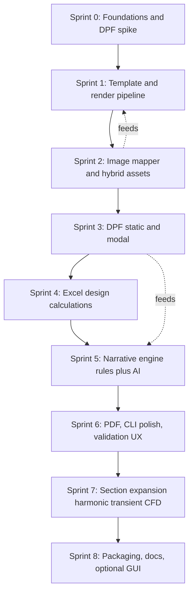

# ANSYS Report Automation — Sprint Plan

> Companion to `IMPLEMENTATION.md`. Detailed, task-level breakdown organized into
> phased sprints. Each sprint lists objective, tasks, owners (role), acceptance
> criteria, deliverables, dependencies, and a definition of done.

- **Cadence assumption:** ~1 week per sprint for a single developer (adjust to team size).
- **Order is dependency-driven:** each sprint produces something runnable.
- **Legend:** [P0] critical path, [P1] important, [P2] nice-to-have.

---

## Sprint Map (at a glance)

---

## Sprint 0 — Foundations and DPF Spike [P0]

**Objective:** Stand up the repo and prove ANSYS extraction is feasible on the target laptop before building anything else.

### Tasks

- **0.1** Initialize repo: `pyproject.toml` (Python 3.10+, console_scripts `ansys-report`), `.gitignore`, `README.md` stub, `output/` ignored.
- **0.2** Create package skeleton `src/ansys_report/` with empty modules per `IMPLEMENTATION.md` §4.
- **0.3** Set up dev tooling: `pytest`, formatter/linter (ruff/black), `nox` or `make` test session.
- **0.4** Add `.env.example` and env loading (no real keys committed).
- **0.5** [P0] **DPF spike:** standalone script that opens one real `.rst` and prints max von-Mises stress + mode-1 frequency. Confirm `ansys-dpf-core` matches installed ANSYS 2024 R2.
- **0.6** Document install steps + ANSYS version in README.

### Dependencies
- One real Workbench project with a solved `.rst` (provided by engineer) for the spike.

### Acceptance Criteria
- `pip install -e .` works; `ansys-report --help` prints.
- Spike script prints a correct stress value and a frequency from a real `.rst`.
- `pytest` runs (even with 0 real tests) green.

### Deliverables
- Runnable package skeleton; DPF feasibility confirmed or risk escalated.

### Definition of Done
- Repo pushed; README documents environment; DPF spike output captured in README or a `docs/spike_notes.md`.

---

## Sprint 1 — Template and Render Pipeline [P0]

**Objective:** Produce a valid DOCX from a mock context (no ANSYS, no Excel) to validate the EP1763 layout and the rendering approach.

### Tasks

- **1.1** Copy `EP1763_May1_R0.docx` → `templates/EP1763_report_template.docx`.
- **1.2** Write `scripts/create_template_from_sample.py` to inject Jinja2 placeholders while preserving `Heading*`/`Caption` styles.
- **1.3** Reduce template to a **minimal** version: cover + §7.1 modal + §7.2 static + §10 placeholders only.
- **1.4** Implement `report/render.py` (docxtpl render) and `report/context_builder.py` (merge fragments).
- **1.5** Implement `config.py` (Pydantic models + YAML loader) and `config/project.example.yaml`.
- **1.6** Create `tests/fixtures/mock_results.json`; wire a `--mock` path in `cli.py build`.
- **1.7** Tests: `test_config.py`, `test_render_smoke.py` (render mock → open with python-docx, assert headings/cover fields present).

### Dependencies
- Sprint 0 skeleton.

### Acceptance Criteria
- `ansys-report build --mock` produces `output/<project>_report.docx`.
- Cover metadata + section headings appear; TOC styles intact.
- Smoke test passes.

### Deliverables
- Minimal working template + render pipeline driven by config + mock data.

### Definition of Done
- A reviewer can open the generated DOCX and recognize the EP1763 layout for the included sections.

---

## Sprint 2 — Image Mapper and Hybrid Assets [P0]

**Objective:** Insert figures into the report from a folder (Path B) and define the optional Mechanical export script (Path A).

### Tasks

- **2.1** Implement `images/mapper.py`: resolve slots from `image_map.yaml`, existence check, PIL resolution/DPI warning, build `InlineImage`s at proper widths.
- **2.2** Add `config/image_map.example.yaml` covering modal modes 1–6, static deformation/stress/reaction, mesh, CAD.
- **2.3** Add `MissingAssets` checklist surfaced by `ansys-report validate`.
- **2.4** Wire inline images + mode-shape loop (``) into the template.
- **2.5** [P1] Write `scripts/mechanical_export_views.py` (runs in Mechanical) calling `ExtAPI.Graphics.ExportImage` at 1920×1080 / DPI≥300 into `image_folder`.
- **2.6** [P1] `extract/mechanical_export.py`: connect via `ansys-mechanical-core` when Mechanical is open; otherwise no-op.
- **2.7** Tests: `test_image_mapper.py` with tiny PNGs (present + missing cases).

### Dependencies
- Sprint 1 template/render.

### Acceptance Criteria
- Mock build with a populated `exports/` folder renders figures with captions.
- `validate` lists missing images as a single checklist.
- Mechanical export script runs inside Mechanical and writes expected filenames (if Mechanical available).

### Deliverables
- Working hybrid image path (folder always; Mechanical optional).

### Definition of Done
- Engineer can drop PNGs in a folder and see them placed correctly; missing assets reported clearly.

---

## Sprint 3 — DPF Static and Modal Extraction [P0]

**Objective:** Auto-fill static and modal numbers/tables from real `.rst` files.

### Tasks

- **3.1** Implement `extract/dpf_base.py` (Model session, unit handling, helpers).
- **3.2** Implement `extract/dpf_static.py`: max von-Mises stress (overall + per material/named selection), max deformation, reaction force/moment, derived FOS.
- **3.3** Implement `extract/dpf_modal.py`: frequencies modes 1..N, participation factors if available.
- **3.4** Implement `extract/dpf_mesh.py`: node/element counts, quality metric summaries.
- **3.5** Implement `scanner.py`: locate `.wbpj`, `.rst` per system, image root, excel path → `ProjectInventory`.
- **3.6** Implement `sections/modal.py` and `sections/static_structural.py` against the `ReportSection` protocol.
- **3.7** Graceful fallback: unresolved values → `None` + "manual entry required" in validator.
- **3.8** Tests: gated DPF tests (`skipif` no ANSYS); offline tests use captured JSON.

### Dependencies
- Sprint 0 spike; Sprint 1 context builder.

### Acceptance Criteria
- `ansys-report build` on a real project fills static stress/deformation/reaction + modal frequency tables/figures.
- Values match Mechanical GUI within rounding.
- Missing/unresolved results reported, not crashed.

### Deliverables
- End-to-end auto extraction for modal + static.

### Definition of Done
- For a real solved project, the generated DOCX shows correct numbers for §7.1 and §7.2.

---

## Sprint 4 — Excel Design Calculations [P1]

**Objective:** Reproduce EP1763 §10 calculation tables from an Excel workbook.

### Tasks

- **4.1** Implement `excel/reader.py` with `openpyxl(data_only=True)`; support named ranges and explicit cell tables.
- **4.2** Normalize to `CalcRow` records (label, symbol, formula, value, unit, source_ref, verdict).
- **4.3** Group into Bolt Load / Flange Moments / Effort / End Flange tables.
- **4.4** Implement `sections/design_calcs.py`; add table loops in template (``).
- **4.5** Surface ACCEPTABLE / NOT ACCEPTABLE verdicts and FOS in rendered tables.
- **4.6** Tests: `test_excel_reader.py` with `sample_calcs.xlsx` → expected rows + verdicts.

### Dependencies
- Sprint 1 render; a representative `.xlsx` (provided).

### Acceptance Criteria
- Design-calc tables render with correct values, units, and verdicts.
- Changing a cell in the workbook changes the rendered table.

### Deliverables
- Working Section 10 generation from Excel.

### Definition of Done
- A reviewer confirms a calc table matches the source workbook.

---

## Sprint 5 — Narrative Engine: Rules + Optional AI [P1]

**Objective:** Generate engineering observations/conclusions deterministically, with optional AI polish.

### Tasks

- **5.1** Implement `narrative/rules.py`:
  - Static: stress vs `warn/fail_fraction_of_yield`; PASS/CAUTION/FAIL verdict + sentences.
  - Modal: each frequency vs `operating_freq_hz ± resonance_margin_hz`; resonance wording.
  - Executive summary stub from per-section verdicts.
- **5.2** Implement `thresholds.yaml` loading + validation.
- **5.3** Implement `narrative/prompts.py` + `narrative/ai.py` (Anthropic/OpenAI), gated on API key; sends scalars + rule draft only.
- **5.4** Fallback: any AI error → rule text + warning log.
- **5.5** Add `--no-ai` flag; auto-disable when no key.
- **5.6** Tests: `test_rules.py` parametrized (below/at/above thresholds, in/out of band); AI test mocked.

### Dependencies
- Sprint 3 extracted numbers.

### Acceptance Criteria
- With no key: deterministic, sensible narratives appear in the DOCX.
- With a key: polished narratives replace drafts; failure falls back cleanly.
- Rule outputs are unit-correct and reference thresholds.

### Deliverables
- Dual-mode narrative integrated into report context.

### Definition of Done
- Generated conclusions are technically defensible for the test project under both modes.

---

## Sprint 6 — PDF, CLI Polish, Validation UX [P0]

**Objective:** Make the tool pleasant and reliable for daily laptop use.

### Tasks

- **6.1** Implement `report/pdf.py`: `docx2pdf` primary, LibreOffice headless fallback, clear message if neither present.
- **6.2** Finalize `cli.py`: `build`, `validate`, `template` commands; flags `--no-pdf`, `--no-ai`, `--verbose`; exit codes (0/2/1).
- **6.3** `validate` aggregates: missing images, unresolved DPF values, missing Excel cells, disabled-AI notice — one checklist.
- **6.4** Improve logging (structured, levels) and user-facing error messages.
- **6.5** [P1] TOC / List of Figures refresh: document "update fields on open"; optional Word COM post-process on Windows.
- **6.6** Tests: CLI smoke (`build --mock --no-pdf`), validate exit-code test.

### Dependencies
- Sprints 1–5.

### Acceptance Criteria
- `ansys-report build` produces DOCX **and** PDF on a Windows+Word laptop.
- `validate` returns exit code 2 and a readable checklist when inputs are incomplete.

### Deliverables
- Production-feel CLI with reliable PDF export and pre-flight validation.

### Definition of Done
- A new user can run one command end-to-end and get DOCX+PDF or a clear list of what's missing.

---

## Sprint 7 — Section Expansion (Harmonic / Transient / CFD) [P1/P2]

**Objective:** Approach EP1763 parity using the section-plugin interface (no renderer changes).

### Tasks

- **7.1** [P1] `sections/harmonic.py` for X; add BC/amplitude/stress figures + per-direction conclusions.
- **7.2** [P1] Extend harmonic to Y and Z directions (config-driven).
- **7.3** [P2] Transient shock sections (X/Y/Z): shock pulse spec table + transient results.
- **7.4** [P2] CFD section: mesh, Y+, velocity/pressure, valve coefficient (likely from Fluent result files/exports).
- **7.5** Extend `image_map.yaml` + template placeholders per added section.
- **7.6** Extend rules for harmonic resonance peaks / amplitude thresholds.
- **7.7** Tests per new section plugin.

### Dependencies
- Sprints 3–5 patterns; representative harmonic/transient/CFD result files.

### Acceptance Criteria
- Enabling `harmonic_y`, `transient_x`, etc. in config adds the sections without code changes elsewhere.
- Figures, tables, and conclusions render correctly for each enabled direction.

### Deliverables
- Configurable coverage of the remaining EP1763 analysis sections.

### Definition of Done
- A multi-load-case report close to EP1763 generates from config toggles.

---

## Sprint 8 — Packaging, Docs, Optional GUI [P1/P2]

**Objective:** Make distribution to laptops effortless.

### Tasks

- **8.1** Finalize README: install, ANSYS version, full worked example, troubleshooting.
- **8.2** [P1] Provide a setup script / pinned `requirements.txt` for non-Python engineers.
- **8.3** [P2] PyInstaller one-folder build (bundles CLI; ANSYS still required externally).
- **8.4** [P2] Optional `gui.py` (Streamlit or Tkinter): folder pick, key field edits, Generate, show checklist + open output.
- **8.5** Author `docs/USER_GUIDE.md` (engineer-facing) and `docs/TEMPLATE_GUIDE.md` (how to add placeholders/sections).
- **8.6** Final end-to-end acceptance on a clean laptop with a fresh project.

### Dependencies
- All prior sprints.

### Acceptance Criteria
- A colleague installs and generates a report following README only.
- (If built) GUI generates a report without using the terminal.

### Deliverables
- Distributable tool + complete documentation (+ optional GUI).

### Definition of Done
- Clean-laptop install-to-report succeeds; success-criteria timings (< 15 min) met for enabled sections.

---

## Cross-Cutting Definition of Done (every sprint)

- Code formatted/linted; new modules have docstrings.
- New behavior covered by at least one test (DPF tests may be skip-gated).
- `README`/relevant `docs/*` updated for any user-facing change.
- `ansys-report build --mock` still passes (no regressions).
- No secrets committed; `.env` stays local.

---

## Milestone Summary

| Milestone | Sprints | Outcome |
|-----------|---------|---------|
| **M1 — Feasibility** | 0 | DPF extraction proven on target laptop |
| **M2 — Document engine** | 1–2 | DOCX from config + images (no ANSYS dependency) |
| **M3 — Automated MVP** | 3–6 | End-to-end DOCX+PDF for modal+static+harmonic_x+design calcs |
| **M4 — Parity + Distribution** | 7–8 | Configurable full coverage + easy laptop install |

---

## Backlog / Phase 2+ (from doc_con, deferred)

- Direct RST parsing optimizations and multi-project comparison.
- Trend-analysis dashboards; design-optimization reports.
- ANSYS Workbench plugin (one-click in-app generation).
- Compliance reports + ASME/ISO validation checks.
- Review/approval workflows.
- Engineering RAG over past reports + standards for richer AI narratives.
